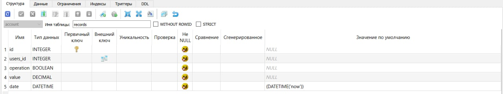
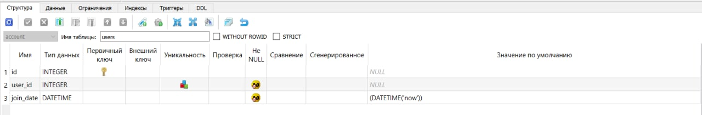
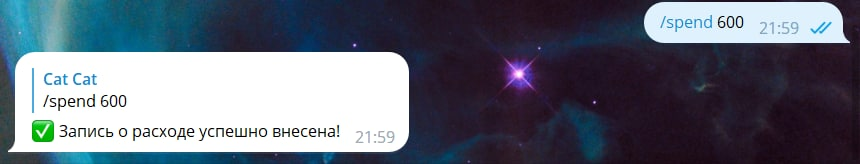
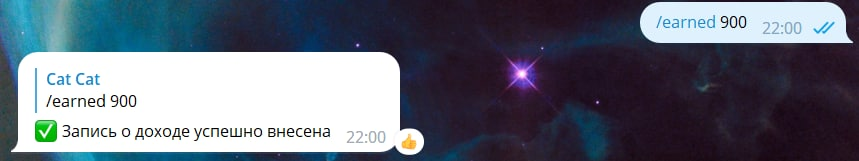
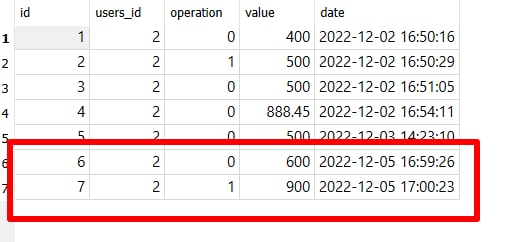
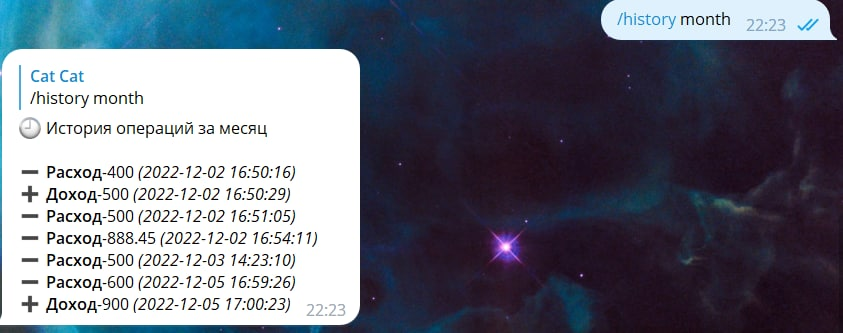

# Бот для записей расходов и доходов с использованием информационной системы

Данный телеграм-бот написан с помощью библиотеки **aiogram** и предназначен для записей дохов и расходов пользователя, а также для хранения истории всех его финансовых операций. 

Для хранения, записи и извлечения информации бот был подключен к базе данных с помощью библиотеки **sqlite3**.

У нас есть две таблицы в базе данных:

- records - предназначена для хранения и записи информации о доходах и расходах от пользователя. Структура таблицы выглядит следующим образом:

- users - предназначена для хранения информаци о пользователях и добавления информации о новых пользователях. Структура таблицы выглядит следующим образом:

Ссылка на ТГ - бот : https://t.me/movie_select_bot

## Функционал бота:

Для пользователя доступны три команды:

- /spend + сумма, которая была потрачена

- /earned + сумма, которую необходимо добавить в виде заработка

- /history - выводит всю историю финансовых операций пользователя.

Давайте посмотрим подробнее, как действуют эти команды.

### Команда spend/earned

С помощью функции `def record` в модуле personal_actions мы считываем операцию, которую пользователь ввел, т.е. определяем, что мы должны записать в базу данных, расход (-) или доход (+), а также считываем сумму дохода или расхода. Вот как это выглядит:

И с помощью функции `def add_record` в модуле db(database) мы уже записываем все данные от пользователя в базу данных:

### Команда history

С помощью функции `def history` в модуле personal_actions мы, во-первых, считываем за какой период пользователю необходимо вывести всю историю по расходам и доходам(день,месяц, год, если же пользователь не ввел конкретный период, то тогда просто передаем ему историю за текущий день), во -вторых, с помощью функции `def get_records` в модуле db "заходим" в базу данных и выдаем пользователю историю операций за нужный период:

